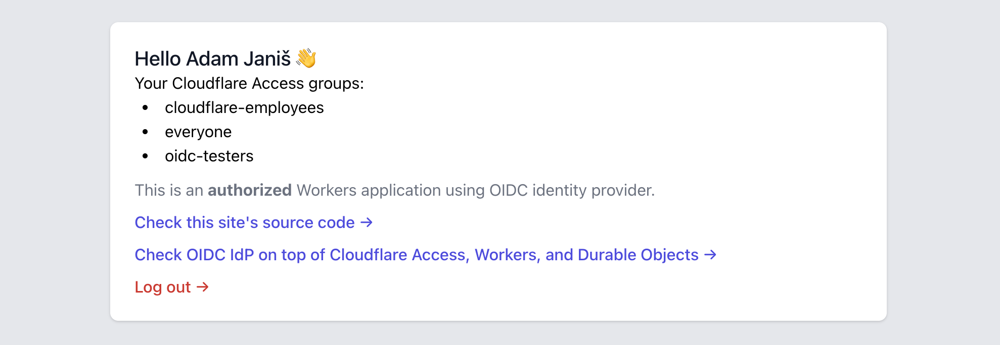

# Cloudflare Access+Workers OIDC provider

Almost stateless OpenID Connect provider completely running on top of Cloudflare for Teams (Access) and Cloudflare Developers platform (Workers, Durable Objects)

## Why its awesome

- OIDC private key is created on-demand and persisted only in Durable Object memory. The private key automatically rotates with Durable Object scale up/down events.
- Only OIDC public keys (jwks) are persisted in Durable Object storage for signature verification purposes. Public keys are automatically cleaned up using CRON Triggers once they are no longer needed.
- Cloudflare Access API is used to fetch and filter user's Access groups, then passed within the ID token as group claims. Applications can scope user permissions based on their groups.

There are some example applications using this OIDC provider, feel free to try them out!

- https://vault.eidam.dev/ui/vault/auth?with=oidc
    - or with Vault CLI `vault login -method=oidc -address=https://vault.eidam.dev`
- https://workers-oidc-example.eidam.workers.dev



## Deployment

### Prerequisites

- Cloudflare account with Workers Paid plan (becuase of Durable Objects) and enabled Cloudflare for Teams
- Wrangler CLI installed

### Cloudflare Access

Cloudflare Access application needs to be deployed to `/authorize` endpoints _(other endpoints are public, 3rd party applications need to be able to fetch JWK keys in order to verify JWTs)_.


### Config file

The only file you need to edit in order to deploy your own OIDC provider is [config.yml](./config.xml)

Following configuration is used and deployed to https://oidc.eidam.dev

```yaml
cf_account_id: fbbebdb1eed350f2a05f517e1d80915f # Cloudflare Account ID
cf_access_team: eidam # Cloudflare for Teams name
cf_access_aud: d27389ecd9bdc9c651bdadea01b6d9f835269f94fa3be1a9f9a4a5c755a1a0f9 # Cloudflare Access application AUD

jwt_ttl: 600 # TTL of the generated JWT tokens, in seconds

clients:
  - name: 'Workers oidc example'
    client_id: b78f6b19-50ca-4bab-85bf-93e6c51ff8fb # should not be guessable, e.g. you can use uuidv4 from https://uuid.rocks/plain
    client_secret_key: SECRET_WORKERS_OIDC_EXAMPLE # should be set with 'wragler secret put SECRET_SOMETHING_SOMETHING' (could be also uuid)
    redirect_uris:
      - https://workers-oidc-example.eidam.workers.dev/auth
    cors_origins:
      - https://workers-oidc-example.eidam.workers.dev

  - name: 'HashiCorp Vault'
    client_id: 3006081d-4f08-47b3-a9fb-23707dcae95b # should not be guessable, e.g. you can use uuidv4 from https://uuid.rocks/plain
    client_secret_key: SECRET_VAULT # should be set with 'wragler secret put SECRET_VAULT' (could be also uuid)
    redirect_uris:
      - https://vault.eidam.dev/ui/vault/auth/oidc/oidc/callback
      - http://localhost:8250/oidc/callback
      - http://127.0.0.1:8250/oidc/callback
```

### Build & Deploy

- `export CF_ACCOUNT_ID=` (Cloudflare Account ID to deploy OIDC provider to)
- `export CF_API_TOKEN=` (Cloudflare API Token with Workers permissions)
- `wrangler secret put CF_SECRET_API_TOKEN` (Cloudflare API Token with Account.Teams read-only permissions, used to fetch user's Access groups)
- `yarn`
- `wrangler publish`

### Worker routes & endpoints

The Worker is not deployed to any domain by default, feel free to configure [wrangler.toml](wrangler.toml) to expose it on one of your domains _(or use the Workers UI)_.

### Profit

Once deployed your OIDC provider is up and ready, with following endpoints are available

- [/.well-known/openid-configuration](https://oidc.eidam.dev/.well-known/openid-configuration) - OIDC configuration discovery
- [/.well-known/jwks.json](https://oidc.eidam.dev/.well-known/jwks.json) - public endpoint with public keys used to verify JWTs
- [/authorize](https://oidc.eidam.dev/authorize) - the only endpoint behind Cloudflare Access, used to authorize the user and initialize the OIDC auth flow
- [/token](https://oidc.eidam.dev/token)
- [/userinfo](https://oidc.eidam.dev/userinfo)
